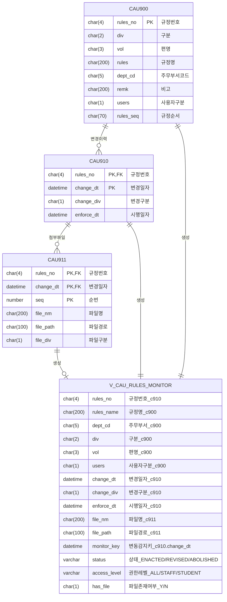

```mermaid
erDiagram
    CAU900 ||--o{ CAU910 : "변경이력"
    CAU910 ||--o{ CAU911 : "첨부파일"
    CAU910 ||--|| V_CAU_RULES_MONITOR : "생성"
    CAU900 ||--|| V_CAU_RULES_MONITOR : "생성"
    CAU911 ||--o| V_CAU_RULES_MONITOR : "생성"

    CAU900 {
        char(4) rules_no PK "규정번호"
        char(2) div "구분"
        char(3) vol "편명"
        char(200) rules "규정명"
        char(5) dept_cd "주무부서코드"
        char(200) remk "비고"
        char(1) users "사용자구분"
        char(70) rules_seq "규정순서"
    }

    CAU910 {
        char(4) rules_no PK,FK "규정번호"
        datetime change_dt PK "변경일자"
        char(1) change_div "변경구분"
        datetime enforce_dt "시행일자"
    }

    CAU911 {
        char(4) rules_no PK,FK "규정번호"
        datetime change_dt PK,FK "변경일자"
        number seq PK "순번"
        char(200) file_nm "파일명"
        char(100) file_path "파일경로"
        char(1) file_div "파일구분"
    }

    V_CAU_RULES_MONITOR {
        char(4) rules_no "규정번호_c910"
        char(200) rules_name "규정명_c900"
        char(5) dept_cd "주무부서_c900"
        char(2) div "구분_c900"
        char(3) vol "편명_c900"
        char(1) users "사용자구분_c900"
        datetime change_dt "변경일자_c910"
        char(1) change_div "변경구분_c910"
        datetime enforce_dt "시행일자_c910"
        char(200) file_nm "파일명_c911"
        char(100) file_path "파일경로_c911"
        datetime monitor_key "변동감지키_c910.change_dt"
        varchar status "상태_ENACTED/REVISED/ABOLISHED"
        varchar access_level "권한레벨_ALL/STAFF/STUDENT"
        char(1) has_file "파일존재여부_Y/N"
    }

```
